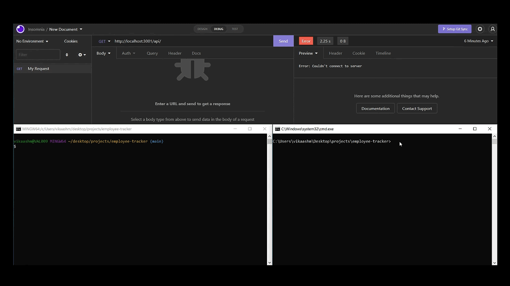
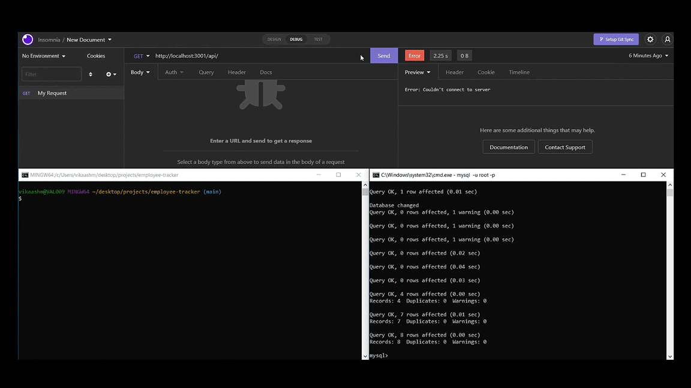
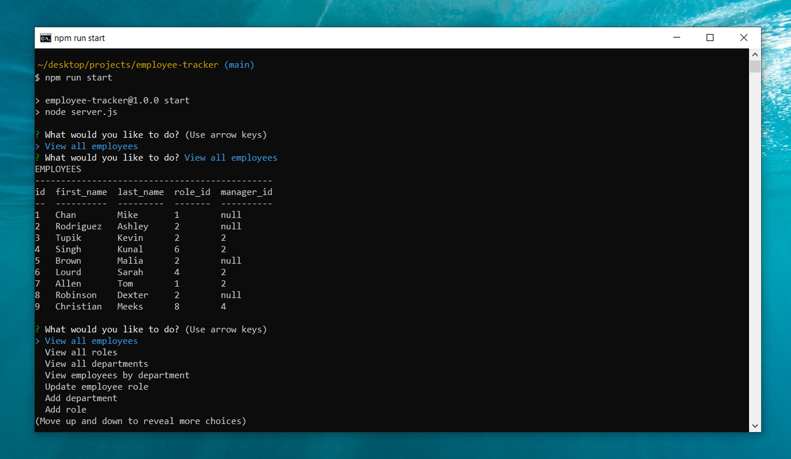

# Vik's Employee Tracker

## Description

Business owners often need to manage the inner workings of their companies, specifically the departments, roles and employees within those businesses. As a result, keeping track of information stored in databases is a critical component of running daily operations, and one of the easiest ways a business owner can interact with their stored information is through a content management system (CMS).

Enter the purpose of this project: utilize Node.js, Express.js, Inquirer, and MySQL to create a command-line application to manage a company's database. The application is easily installed and initialized, and includes the following features:

- Once the application starts the user is presented with the options to view all employees, view all roles, view all departments, or view employees by department.
- The user is also presented with options to update a current employee's role, add a new department, add a new role, or add a new employee.
- If the user chooses to view current employees, roles, or departments, they are presented with a formatted table showing the results.
- If the user chooses to view a current role or current employee, they are presented with the data along with the corresponding salary for that result.
- If the user chooses to add a new department, role, or employee, they are able to enter the information into the CLI and the database will be updated accordingly.


## Installation

To install this application, first clone the repo to your local machine. Then, you will need to install the node dependencies/modules which can be done by running the ```npm install``` command in your terminal/bash shell. 


## Usage

To use this application, you first need to have MySQL installed, and then initialize the database:



 Once this has been completed, you are ready to use the application, so open up the repo's folder in your terminal/bash shell and run the command ```node server.js``` or ```npm run start```. 



You will then be informed that the program has started, and will be given prompts, and can select from various options the information you would like to request or modify. 

Here is an example of the application from the CLI:



A full video walkthrough can be found [here](https://vimeo.com/710039912).


## Credits

Collaborators include the instructor, TAs, and fellow classmates of the UCF Coding Bootcamp (Spring 2022).


## License

Copyright (c) 2022 Vik Maharaj

Permission is hereby granted, free of charge, to any person obtaining a copy of this software and associated documentation files (the "Software"), to deal
in the Software without restriction, including without limitation the rights to use, copy, modify, merge, publish, distribute, sublicense, and/or sell copies of the Software, and to permit persons to whom the Software is furnished to do so, subject to the following conditions:

The above copyright notice and this permission notice shall be included in all copies or substantial portions of the Software.

THE SOFTWARE IS PROVIDED "AS IS", WITHOUT WARRANTY OF ANY KIND, EXPRESS OR IMPLIED, INCLUDING BUT NOT LIMITED TO THE WARRANTIES OF MERCHANTABILITY,
FITNESS FOR A PARTICULAR PURPOSE AND NONINFRINGEMENT. IN NO EVENT SHALL THE AUTHORS OR COPYRIGHT HOLDERS BE LIABLE FOR ANY CLAIM, DAMAGES OR OTHER LIABILITY, WHETHER IN AN ACTION OF CONTRACT, TORT OR OTHERWISE, ARISING FROM, OUT OF OR IN CONNECTION WITH THE SOFTWARE OR THE USE OR OTHER DEALINGS IN THE SOFTWARE.


## Badges


[](https://opensource.org/licenses/MIT)